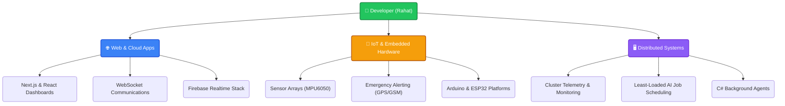

# Hi there, I'm Rahat! 👋 

<p align="center">
  
</p>

<p align="center">
  <a href="https://github.com/ryo-ma/github-profile-trophy">
    
  </a>
</p>

---

```bash
rahat@desktop:~$ neofetch --user rahat300809
```
```
      /\_/\         rahat300809@github
     ( o.o )        ------------------
      > ^ <         OS: Windows 11 / Linux
                    Role: Full-Stack & IoT Systems Engineer
                    Shell: PowerShell / Zsh
                    Languages: TypeScript, C++, C#, Kotlin, Java, C
                    Frameworks: Next.js, React, Node.js, Express, .NET 9
                    Databases: Cloud Firestore, Firebase RTDB, SQL
                    IoT Hardware: ESP32, Arduino, MPU6050, GPS, GSM
                    Active Project: ClusterOS (Distributed Compute Manager)
```

---

## 🚀 About Me

I am a passionate software engineer and hardware enthusiast specializing in building highly scalable, distributed systems, interactive web applications, real-time networking protocols, and IoT smart devices. I love turning complex problems into clean, robust, and user-friendly products.

---

## 💡 Philosophy & Motivation

> ⚡ **"Complexity is the enemy of execution. I design systems where hardware meets the cloud, and logic meets efficiency."**
> 
> *As a software developer and hardware integrator, my philosophy revolves around building robust, low-latency applications that connect the physical world with cloud ecosystems. Whether balancing heavy AI workloads on distributed PC clusters, engineering real-time safety algorithms for IoT helmets, or securing web transactions with block-hashed chains, I write clean, thread-safe, and highly maintainable code.*

---

## 🛠️ Tech Stack & Skills

<table>
  <tr>
    <td valign="top" width="50%">
      <h3>💻 Programming Languages</h3>
      <p>
        
        
        
        
        
        
        
      </p>
      <h3>🌐 Web & Backend Frameworks</h3>
      <p>
        
        
        
        
        
      </p>
    </td>
    <td valign="top" width="50%">
      <h3>☁️ Databases & Cloud</h3>
      <p>
        
        
        
        
      </p>
      <h3>🔌 IoT & Embedded Systems</h3>
      <p>
        
        
        
      </p>
    </td>
  </tr>
</table>

---

## 🌟 Featured Projects

### 🖥️ [ClusterOS](https://github.com/rahat300809/cluster_sheduling_AI)
An AI-powered distributed PC monitoring, remote command execution, and cluster workload manager.
- **Tech Stack:** Next.js 16, TypeScript, Tailwind CSS, Firebase (Auth, Firestore, RTDB), C# .NET 9, Kotlin & Jetpack Compose (Android).
- **Core Features:** Real-time hardware telemetry streaming (CPU, RAM, GPU, temps) every 5 seconds, multi-device process management, remote shell execution, and intelligent AI workload routing to the lowest-load node.
- **Live Demo:** [cluster300809.web.app](https://cluster300809.web.app)

### 🏍️ [Smart Crash Detection Helmet](https://github.com/rahat300809/Crash_detection_Helmet)
An IoT-based safety system built into a helmet to detect collisions and dispatch coordinates in emergencies.
- **Tech Stack:** C++, MPU6050 Accelerometer/Gyroscope, GPS Module, GSM Module, Arduino/ESP32.
- **Core Features:** Real-time impact/accident detection via high-G accelerometer analysis, automatic SOS trigger, and SMS notification containing live latitude/longitude tracking links sent directly to emergency contacts.

### 🚀 [QuickPush](https://github.com/rahat300809/QuickPush)
A desktop tool built for developers to push projects directly to GitHub with a single click, bypassing Git terminal commands.
- **Tech Stack:** JavaScript, Node.js, GitHub API.
- **Core Features:** Automatically detects uncommitted directories, provisions repo configurations, adds, commits, and pushes folders instantly.

### 🔒 [Blockchain Voting & Banking Systems](https://github.com/rahat300809/Blockchain-Based-voting-system_backend_cpp)
Secure decentralized backends built to prevent transactional fraud and election tampering.
- **Tech Stack:** C++, HTML/JS.
- **Core Features:** Immutable block-hashing ledger architecture, consensus simulation, decentralized verification rules, and secure web interface for logging votes.

### 💬 [WebSocket Web Messenger](https://github.com/rahat300809/Messenger-for-personal-use)
A lightweight real-time communication platform designed for personal connectivity.
- **Tech Stack:** TypeScript, Node.js, WebSockets, HTML/CSS.
- **Core Features:** Sub-10ms latency instant message transfers, status updates (online/offline indicators), and multi-room separation.

### 💻 [Codebox Code-Sharing Website](https://github.com/rahat300809/Code_Sharing-website)
A collaborative utility web tool to format, store, and share code snippets.
- **Tech Stack:** HTML, JavaScript, Firebase.
- **Live Demo:** [codebox300809.web.app](https://codebox300809.web.app/)

---

## 📊 Developer Ecosystem Architecture

Below is the high-level flow of how my core projects connect across the web, distributed services, and physical hardware interfaces:



---

## 📊 Activity & Contributions

<p align="center">
  <a href="https://github.com/ashutosh00710/github-readme-activity-graph">
    
  </a>
</p>

---

## 📈 GitHub Stats

<p align="center">
  
</p>

---

<p align="center">
  Let's connect and build something awesome! 🚀
</p>
