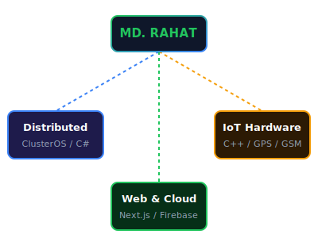

# MD. Rahat Mahamud 👋

<table border="0" width="100%">
  <tr>
    <td width="55%" valign="top">
      

        
      

      
I am a passionate software engineer and hardware integrator specializing in building highly scalable distributed systems, interactive web applications, real-time networking protocols, and IoT smart devices.

      
<b>🔍 Main Focus:</b> High-performance networking, cloud/hardware bridges, and edge compute balancing.

      

        
      

    </td>
    <td width="45%" valign="top" align="center">
      
    </td>
  </tr>
</table>

---

##  Coding Streaks

  

---

##  Featured Projects

###  [ClusterOS](https://github.com/rahat300809/cluster_sheduling_AI)
An AI-powered distributed PC monitoring and cluster workload scheduler.
- **Stack:** Next.js 16, C# .NET 9, Kotlin (Android), Firebase RTDB & Firestore.
- **Core:** 5s telemetry loop, remote command execution, and weighted least-loaded workload balancing.

###  [Smart Crash Detection Helmet](https://github.com/rahat300809/Crash_detection_Helmet)
An IoT-based safety system built into a helmet to detect collisions and dispatch emergency alerts.
- **Stack:** C++, MPU6050 Accelerometer/Gyroscope, GPS, GSM, Arduino/ESP32.
- **Core:** High-G collision analysis and automatic SOS SMS tracking links.

###  [QuickPush](https://github.com/rahat300809/QuickPush)
A desktop tool to automatically add, commit, and push folders to GitHub with one click.
- **Stack:** Node.js, JavaScript, GitHub API.

###  [Blockchain Ledgers](https://github.com/rahat300809/Blockchain-Based-voting-system_backend_cpp)
Decentralized e-voting and banking ledgers to prevent data tampering.
- **Stack:** C++, Web UI.

---

  Let's connect and build something awesome! 🚀

